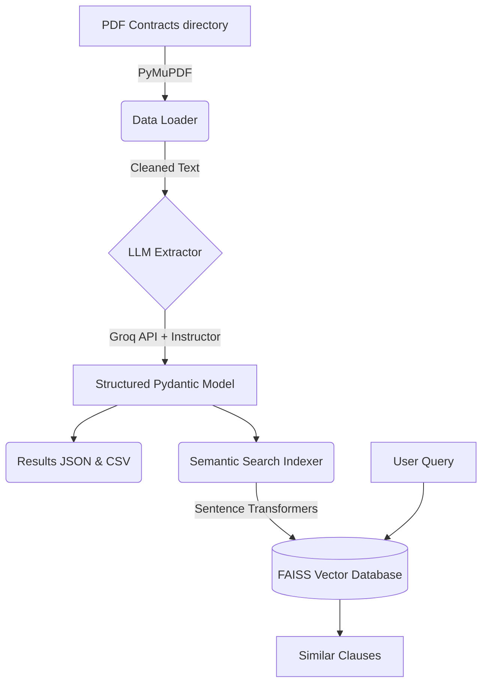

# Legal Contract LLM Processing Pipeline

This repository contains a complete, modular, and robust Python pipeline for processing legal contracts using Large Language Models (LLMs). The system extracts unstructured text from PDFs, leverages Groq's high-performance inference for structural data extraction, and builds a local semantic search engine over the extracted clauses.

## Features

- **Automated PDF Parsing**: Extracts and normalizes text from PDF contracts using PyMuPDF.
- **Structured LLM Extraction**: Uses Groq and Pydantic to extract specific clauses (summary, termination, confidentiality, liability) reliably into a strict JSON schema.
- **Semantic Search**: Embeds extracted clauses using `sentence-transformers` and stores them in FAISS for fast similarity search.
- **CSV & JSON Exports**: Automatically structures and saves the outputs for downstream analysis.

## Architecture



## How to Run

### 1. Setup Virtual Environment
It is highly recommended to use a Python virtual environment (requires Python 3.10+):
```bash
python -m venv venv
# On macOS/Linux:
source venv/bin/activate
# On Windows:
venv\Scripts\activate
```

### 2. Install Requirements
```bash
pip install -r requirements.txt
```

### 3. Configure Environment Variables
Create a `.env` file in the root directory and add your Groq API key:
```env
GROQ_API_KEY=your_groq_api_key_here
```

### 4. Prepare Data
Place your PDF contract files into the `data/` directory (created automatically when you run the script for the first time, or you can create it manually).
```bash
mkdir data
# Copy your 50 CUAD PDFs or other contracts into the data/ folder
```

### 5. Run the Pipeline
```bash
python main.py
```
This will:
1. Load and parse all PDFs.
2. Extract the structured fields sequentially using Groq.
3. Save the results to `output/results.json` and `output/results.csv`.
4. Index the clauses and perform a sample semantic search query to demonstrate functionality.

## Architectural Decisions

- **Why Groq?**: Groq provides ultra-fast inference speeds, which is crucial when processing dozens or hundreds of contracts sequentially. By utilizing models like `llama-3.3-70b-versatile`, we balance incredible reasoning capabilities with low latency.
- **Why Pydantic and Instructor?**: Extracting data from LLMs can be unpredictable. By defining a strict Pydantic model (`ContractExtraction`) and wrapping the Groq client with Instructor, we guarantee that the LLM output conforms exactly to our required schema (summary, termination, confidentiality, liability) without having to build complex string-parsing logic.
- **How Semantic Search Works**: The extracted clauses are not just saved to a CSV. They are embedded into dense vector representations using `sentence-transformers` (`all-MiniLM-L6-v2` for a great balance of speed and accuracy) and indexed in FAISS (Facebook AI Similarity Search). This allows users to query the database using natural language (e.g., "What happens if a party breaches?") and mathematically find the most semantically relevant clauses across the entire corpus of contracts.